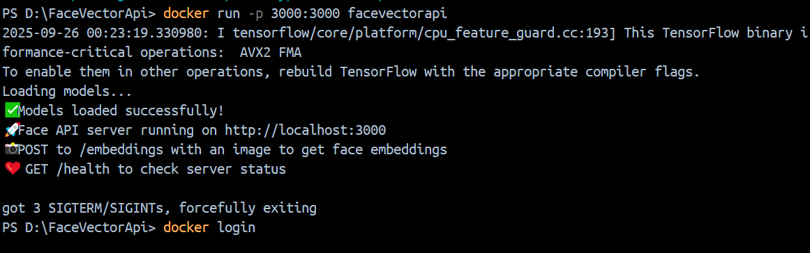
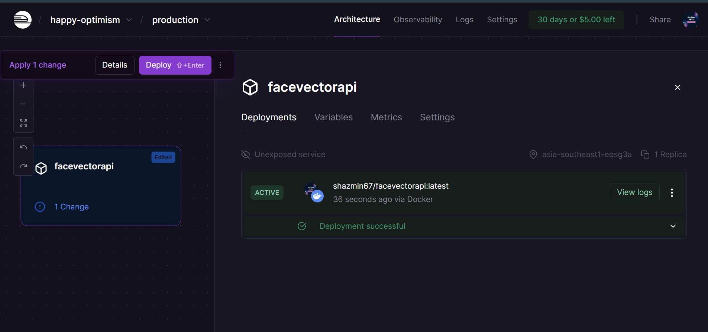
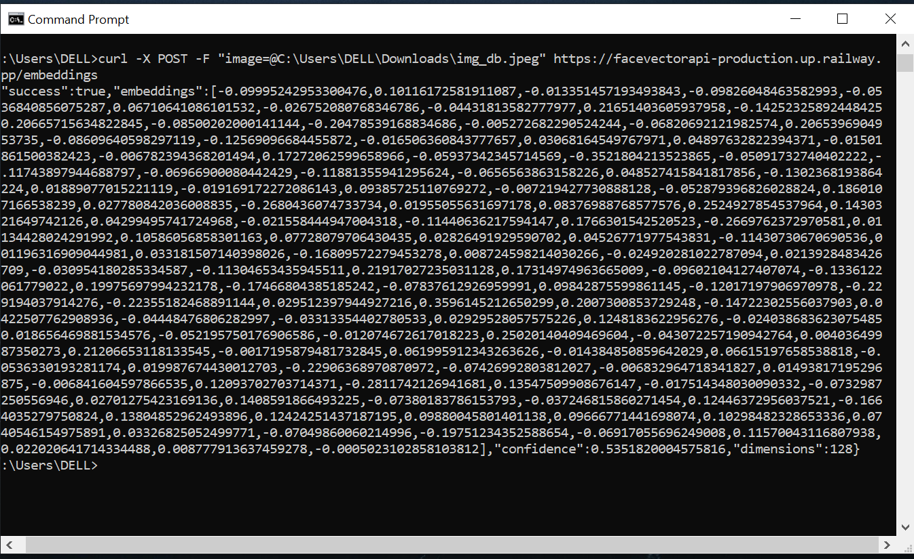

# FaceVectorAPI

**FaceVectorAPI** is a Node.js API server that generates **128-dimensional face embeddings** using `face-api.js`. It provides a single, easy-to-use endpoint for extracting face descriptors from images, designed for seamless integration with web or mobile applications.

## Features

- Generates 128D face embeddings using pretrained `face-api.js` models
- Single model setup, eliminating the need for multiple local models
- Dockerized for consistent and portable deployment
- Resolves Windows-specific TensorFlow DLL issues
- Deployed on Railway for cloud accessibility


## Table of Contents

1. [Prerequisites](#prerequisites)
2. [Local Setup](#local-setup)
3. [TensorFlow.js Node Fix (Windows)](#tensorflowjs-node-fix-windows)
4. [Running Locally](#running-locally)
5. [Docker Setup](#docker-setup)
6. [Pushing to Docker Hub](#pushing-to-docker-hub)
7. [Railway Deployment](#railway-deployment)
8. [API Usage](#api-usage)
9. [Limitations & Pain Points Solved](#limitations--pain-points-solved)


## Prerequisites

- **Node.js**: v18.20.0 (LTS recommended)
- **Python 3**: Required for native module compilation
- **Visual Studio Build Tools**: For Windows native builds
- **Git**: For cloning and version control
- **Docker**: For containerized deployment (optional)


## Local Setup

1. Clone the repository:

   ```bash
   git clone https://github.com/shazmin67/FaceVectorAPI.git
   cd FaceVectorAPI
   ```

2. Install dependencies:

   ```bash
   npm install
   ```

   Key dependencies:
   - `@tensorflow/tfjs-node`: TensorFlow backend for Node.js
   - `@vladmandic/face-api`: Face recognition library
   - `canvas`: Image processing
   - `express`: API server
   - `multer`: Image upload handling

---

## TensorFlow.js Node Fix (Windows)

On Windows, `@tensorflow/tfjs-node` may fail to locate `tensorflow.dll`. To fix:

```bash
cp node_modules/@tensorflow/tfjs-node/deps/lib/tensorflow.dll node_modules/@tensorflow/tfjs-node/lib/napi-v8/
```

This step is only required for Windows. Linux/macOS setups handle this automatically in Docker.


## Running Locally

Start the server:

```bash
node index.js
```

- **Health check**: `GET /health`
- **Face embeddings**: `POST /embeddings` (multipart/form-data with image)

Example request:

```bash
curl -X POST -F "image=@img_db.jpeg" http://localhost:3000/embeddings
```

Example response:

```json
{
  "success": true,
  "embeddings": [0.123, 0.456, ..., 0.789],
  "confidence": 0.98,
  "dimensions": 128
}
```


## Docker Setup

1. Use the provided `Dockerfile`:

   ```dockerfile
   FROM node:18.20.0-bullseye

   RUN apt-get update && apt-get install -y \
       libcairo2-dev libpango1.0-dev libjpeg-dev libgif-dev librsvg2-dev \
       python3 make g++

   WORKDIR /app
   COPY package*.json ./
   RUN npm install
   COPY . .
   EXPOSE 3000
   CMD ["node", "index.js"]
   ```

2. Build the Docker image:

   ```bash
   docker build -t facevectorapi .
   ```

3. Run the container:

   ```bash
   docker run -p 3000:3000 facevectorapi
   ```

4. Test endpoints:
   - Health: `curl http://localhost:3000/health`
   - Embeddings: `curl -X POST -F "image=@img_db.jpeg" http://localhost:3000/embeddings`





## Pushing to Docker Hub

1. Tag the image:

   ```bash
   docker tag facevectorapi shazmin67/facevectorapi:latest
   ```

2. Log in to Docker Hub:

   ```bash
   docker login
   ```

3. Push the image:

   ```bash
   docker push shazmin67/facevectorapi:latest
   ```

   Image available at: [hub.docker.com/r/shazmin67/facevectorapi](https://hub.docker.com/r/shazmin67/facevectorapi)


## Railway Deployment

1. Go to [Railway](https://railway.app/), create a new project, and select **Deploy Docker Image**.
2. Use the Docker Hub image: `shazmin67/facevectorapi:latest`.
3. Set environment variable:

   ```
   PORT=3000
   ```

4. Deploy to get a public URL, e.g., `https://facevectorapi-production.up.railway.app`.

Test endpoints:
- Health: `GET /health`
- Embeddings: `POST /embeddings`


## API Usage

- **Health Check**:

   ```bash
   curl https://facevectorapi-production.up.railway.app/health
   ```

   



- **Get Face Embeddings**:

   ```bash
   curl -X POST -F "image=@img_db.jpeg" https://facevectorapi-production.up.railway.app/embeddings
   ```




Use embeddings for face verification, similarity comparison, or clustering.


## Limitations & Pain Points Solved

- **Single High-Accuracy Model**: Uses the `FaceRecognitionNet` from `face-api.js` to extract 128D embeddings, avoiding the need to set up local workspace and additional dependencies required by models like FaceNet or ArcFace.  
- **Language Independent Usage**: Although the server is built with Node.js and Express, it can be called from **any platform or language** — Android, iOS, web, etc.  
- **Simplified Setup**: No need to convert models to TFLite or manage local model files, which can lead to accuracy loss and extra scripting.  
- **Windows DLL Fix**: Manually resolved TensorFlow DLL issues to ensure smooth setup on Windows.  
- **Dockerized**: Provides consistent builds across platforms, avoiding native compilation errors.  
- **Seamless Deployment**: Works locally, in Docker, or on Railway with no conversion issues, making integration into any app straightforward.  


This project showcases an **end-to-end face embeddings API**, from local development to cloud deployment, ready for backend integration.


